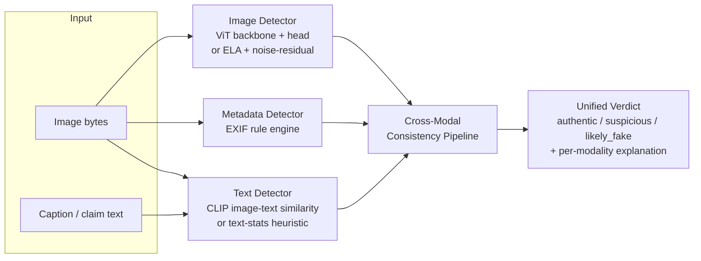

# Multimodal Synthetic Content Authentication Engine

A from-scratch, learning-scale reimplementation of a cross-modal content
authentication pipeline: it inspects an image, its caption/claimed
description, and its embedded metadata, and fuses all three into a single
explainable authenticity verdict.

> **Scope note.** This is an independent personal-learning build, written to
> explore the architecture behind multimodal authenticity detection (ViT-based
> image forensics, CLIP-based image/text consistency, EXIF metadata auditing,
> and score fusion). It is not the original production/research system it was
> inspired by, has no labeled training run behind it, and the numbers in
> `benchmarking/report.md` come from procedurally generated fixtures, not a
> real deepfake dataset. See [Limitations](#limitations) below.

## Why it's built this way

Every detector ships with **two execution paths**:

1. **Model-backed** — a ViT backbone (`google/vit-base-patch16-224-in21k`) for
   image analysis and CLIP (`openai/clip-vit-base-patch32`) for image/text
   consistency, via `transformers`/`torch`.
2. **Heuristic fallback** — dependency-light, classical signal processing
   (JPEG error-level analysis, high-frequency noise-residual analysis, EXIF
   rule checks, text burstiness/vocabulary-richness stats) that needs only
   Pillow/NumPy/OpenCV.

The engine automatically falls back to path 2 if `torch`/`transformers` aren't
installed, if a model fails to download, or if `USE_PRETRAINED_MODELS=0` is
set. That means you can clone this, skip the multi-GB PyTorch/HF download, and
still get a working (if less accurate) authentication API on a laptop with no
GPU and no internet. Flip pretrained mode back on once you want the real
model path.

## Architecture



Fusion is a transparent weighted average (`app/config.py: Settings.weights`)
with a **weakest-link override**: if the image or metadata detector fires
hard enough on its own to call something fake, that can't be diluted away by
two clean-looking modalities. See `app/pipeline/consistency_pipeline.py` for
the full reasoning in comments.

## Project layout

```
app/
  main.py                     FastAPI app + routes
  config.py                   Model names, fusion weights, thresholds
  schemas.py                  Pydantic request/response models
  detectors/
    image_detector.py         ViT backbone / ELA + noise-residual heuristics
    text_detector.py          CLIP similarity / text-stats heuristics
    metadata_detector.py      EXIF rule-based spoofing checks
  pipeline/
    consistency_pipeline.py   Fuses the three detectors into one verdict
  utils/image_utils.py        ELA + noise-residual math
benchmarking/
  attack_fixtures.py          Procedural fixture generator (4 attack categories)
  run_benchmark.py            Runs the pipeline over fixtures, writes report.md
tests/                        unittest-based (pytest-compatible) test suite
Dockerfile
requirements.txt
```

## Quickstart

```bash
python3 -m venv .venv && source .venv/bin/activate
pip install -r requirements.txt

# Run the API (heuristic-only mode, no model download needed)
USE_PRETRAINED_MODELS=0 uvicorn app.main:app --reload

# Or with the real ViT/CLIP models (downloads ~1-2GB from Hugging Face on first run)
pip install -r requirements-ml.txt
USE_PRETRAINED_MODELS=1 uvicorn app.main:app --reload
```

Then visit `http://127.0.0.1:8000/docs` for interactive Swagger docs.

### Example requests

```bash
# Full pipeline: image + caption -> unified verdict
curl -X POST http://127.0.0.1:8000/v1/authenticate \
  -F "file=@photo.jpg" \
  -F "caption=A street photo taken at sunset."

# Image-only forensics
curl -X POST http://127.0.0.1:8000/v1/authenticate/image -F "file=@photo.jpg"

# EXIF metadata audit only
curl -X POST http://127.0.0.1:8000/v1/authenticate/metadata -F "file=@photo.jpg"
```

Example response from `/v1/authenticate`:

```json
{
  "verdict": "likely_fake",
  "unified_score": 0.3556,
  "image": {"score": 0.84, "label": "authentic", "method": "heuristic_ela_noise_residual", "details": {...}},
  "text": {"score": 0.71, "label": "likely_human", "method": "heuristic_text_stats", "details": {...}},
  "metadata": {"score": 0.2, "label": "likely_spoofed", "method": "exif_rule_based", "details": {"findings": ["editing_software_fingerprint:adobe photoshop 25.0"]}},
  "explanation": "metadata signal: likely_spoofed (editing_software_fingerprint:adobe photoshop 25.0)"
}
```

## Fine-tuning the image classification head

The ViT path ships with a real backbone and an **untrained** linear
classification head (authentic vs. manipulated) — the resume-line "fine-tuned
vision transformer" only becomes literally true once you train it. A minimal
recipe:

1. Gather a labeled dataset (FaceForensics++, DFDC, or your own).
2. Extract CLS-token embeddings from the frozen `google/vit-base-patch16-224-in21k`
   backbone (`app/detectors/image_detector.py: _ModelBackedScorer._ensure_loaded`
   shows how it's loaded).
3. Train the linear head on those embeddings; save with `torch.save(head.state_dict(), ...)`.
4. Pass `head_state_dict_path=...` into `ImageAuthDetector.analyze()`, or wire
   it into `app/config.py`.

## Benchmarking

```bash
python -m benchmarking.run_benchmark --n-per-category 10
```

Runs the pipeline against procedurally generated fixtures across four
categories (`clean`, `adversarial_perturbation`, `metadata_spoofed`,
`manipulated_splice`) and writes `benchmarking/report.md` with per-category
precision/recall/F1. See `benchmarking/README.md` for how to point this at a
real dataset instead.

## Testing

```bash
pytest tests/ -v
# or, no pytest install required:
python -m unittest discover -s tests -v
```

All 13 tests run in heuristic-only mode by design, so the suite (and CI) never
needs a torch/transformers install or a model download.

## Deploying

- `Dockerfile` builds a CPU-only image by default (`docker build -t auth-engine .`);
  pass `--build-arg INSTALL_ML=1` to include torch/transformers.
- Any container platform works (Render, Fly.io, Railway, a spare VM). For a
  free live demo, a Hugging Face Space with the Docker SDK pointed at this
  Dockerfile is the path of least resistance.

## Limitations

- The ViT classification head is architecturally wired up but **untrained**
  until you fine-tune it (see above) — out of the box, only the heuristic
  fallback (ELA + noise-residual) is doing real work on the image side.
- Benchmark fixtures are synthetic/procedural, not real deepfakes or real
  adversarial examples generated against a target model — they validate the
  fusion/harness logic, not real-world detection accuracy.
- Text-only heuristics (burstiness/vocabulary richness) are noisy on short
  captions; this is a known, documented weakness, not a hidden one (see
  `app/pipeline/consistency_pipeline.py` for how fusion deliberately limits
  its influence).
- Not adversarially hardened: someone targeting this specific pipeline could
  likely find inputs that fool the heuristic paths.

## Roadmap

- Replace the linear ViT head with a small learned fusion model once labeled
  multimodal data is available, instead of the fixed weighted-average + veto rule.
- Swap the text-stats fallback for a lightweight perplexity model.
- Add a `/v1/authenticate/batch` endpoint and async job queue for larger uploads.

## License

MIT — see [LICENSE](LICENSE).
